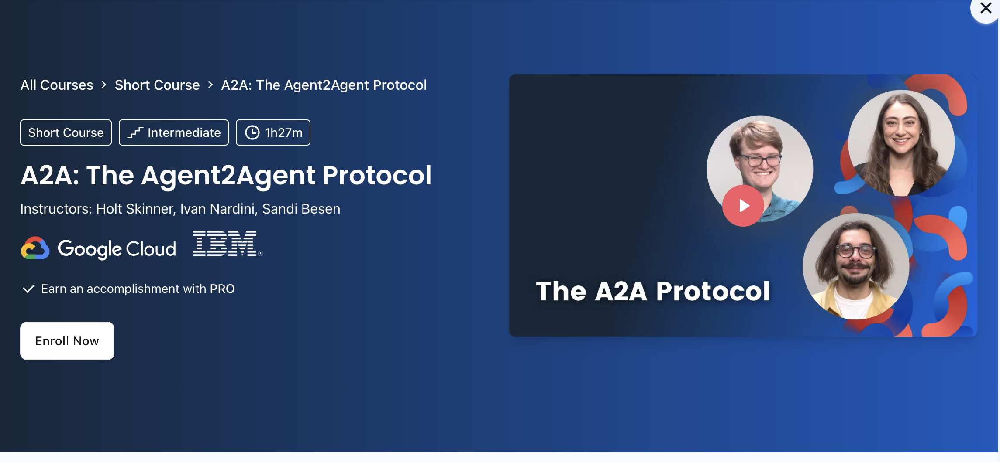

# A2A Protocol: Agentic AI on Vertex AI (DeepLearning.AI)

**Course:** [A2A Protocol: Agentic AI on Vertex AI](https://www.deeplearning.ai/short-courses/a2a-protocol/)

Build production-grade agentic AI systems using Google Vertex AI. Learn prompt caching, multi-turn conversations, and tool-based agent patterns with Claude.

## What you will learn

- Agentic AI fundamentals and architecture patterns
- Building QA agents with Claude on Vertex AI
- Prompt caching for cost optimization
- Multi-turn conversation management
- Tool calling and function integration
- Agent workflow orchestration
- Production deployment strategies

## Notebook order

| Order | Notebook | Lesson title |
| ----- | -------- | ------------ |
| 1 | [L3.ipynb](L3.ipynb) | Building a QA Agent with Claude on Vertex AI |
| 2 | [L4.ipynb](L4.ipynb) | Prompt Caching & Cost Optimization |
| 3 | [L5.ipynb](L5.ipynb) | Multi-Turn Conversations |
| 4 | [L6.ipynb](L6.ipynb) | Advanced Tool Calling |
| 5 | [L7.ipynb](L7.ipynb) | Agent Workflow Patterns |
| 6 | [L8.ipynb](L8.ipynb) | Error Handling & Robustness |
| 7 | [L9.ipynb](L9.ipynb) | Performance Optimization |
| 8 | [L10.ipynb](L10.ipynb) | Production Deployment |

Lessons 1–2 are covered in course videos; start at Lesson 3 in notebooks.

## Setup

- **Packages:** `anthropic`, `google-cloud-aiplatform`, `google-auth`
- **Hardware:** CPU sufficient; cloud GPU for advanced features
- **API keys:** 
  - Anthropic Claude API token ([.env.example](../.env.example))
  - Google Cloud credentials (Vertex AI access)
  - GCP project with Vertex AI enabled

## Tips

- Lessons 3–5 are foundational; build agent patterns here before advancing
- Lesson 4 on prompt caching significantly reduces API costs—apply early
- Lesson 8 covers production robustness; don't skip error handling
- Test locally before deploying to Vertex AI in Lesson 10
- Use gcloud CLI to authenticate: `gcloud auth application-default login`

## Key Concepts

**Agentic AI:** AI systems that perceive, plan, and act autonomously using tools

**Prompt Caching:** Reuse cached prompt context to reduce latency and cost

**Tool Calling:** Agent invokes functions/APIs to gather information or take actions

**Multi-Turn Conversations:** Stateful agent interactions maintaining context across exchanges

**Workflow Orchestration:** Coordinating multiple agents and tools in complex pipelines

**Vertex AI Integration:** Leveraging Google Cloud infrastructure for scale and reliability

[← Back to learning path](../README.md)

## Extra Resources

- [Vertex AI Documentation](https://cloud.google.com/vertex-ai/docs)
- [Claude API Guide](https://docs.anthropic.com/)
- [Agent Design Patterns](https://www.anthropic.com/research)
