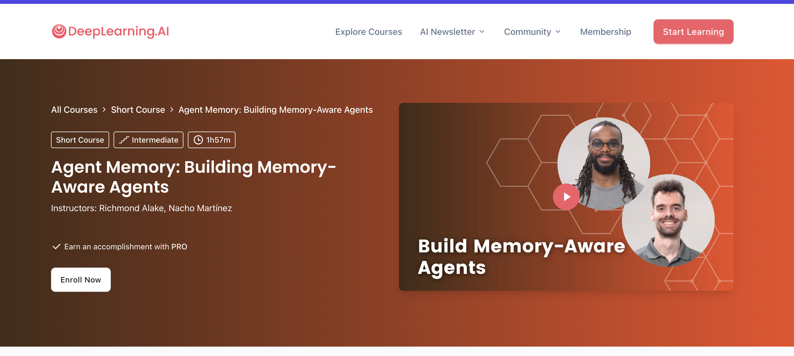
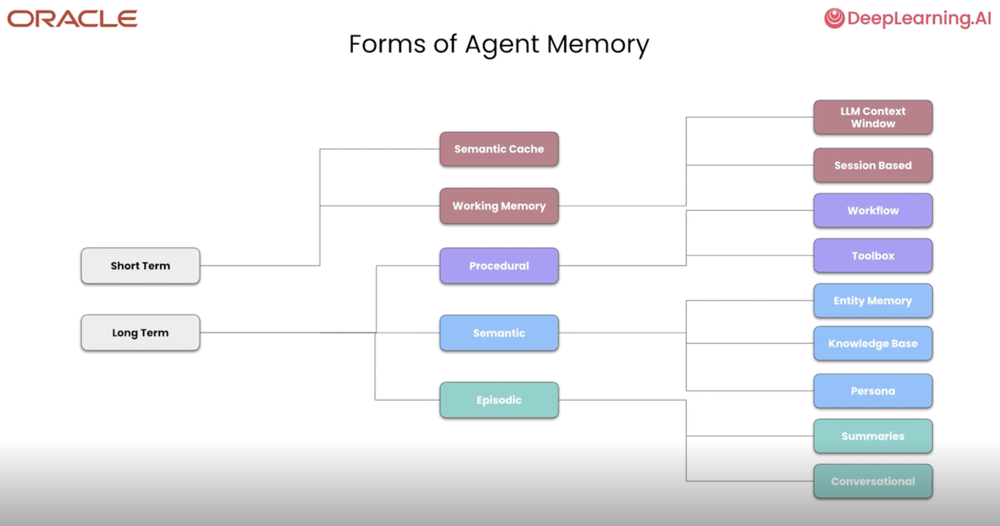
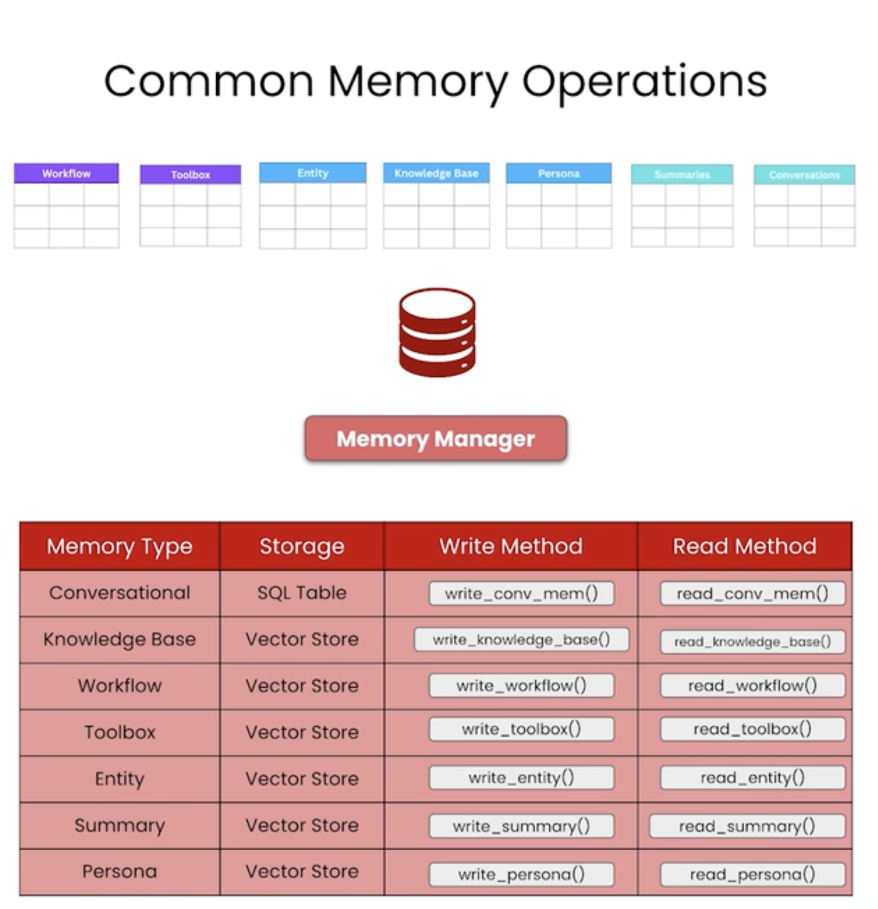
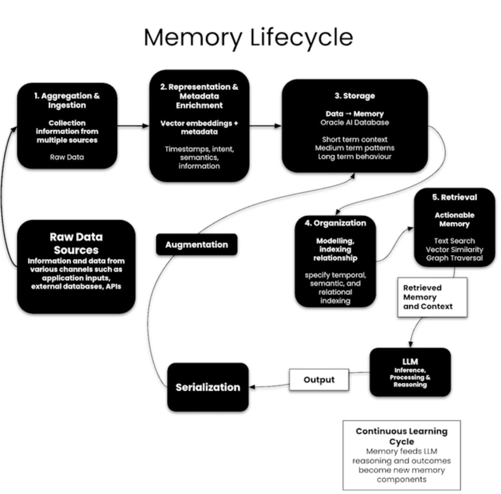
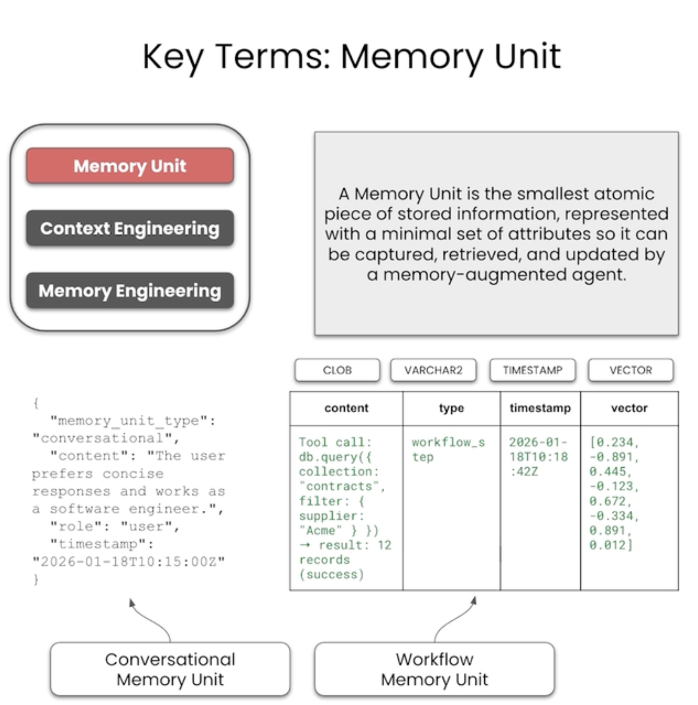
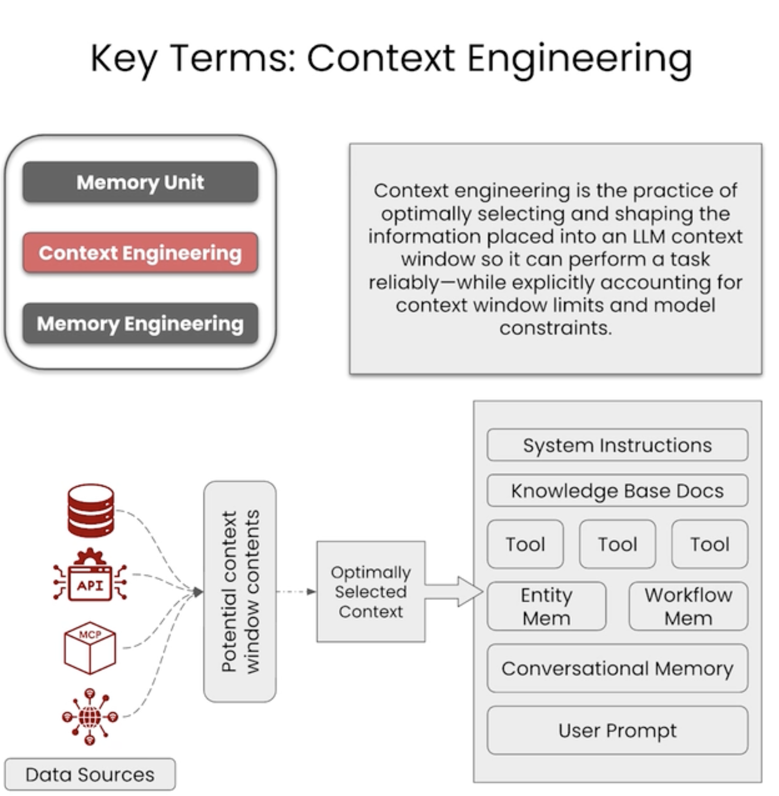
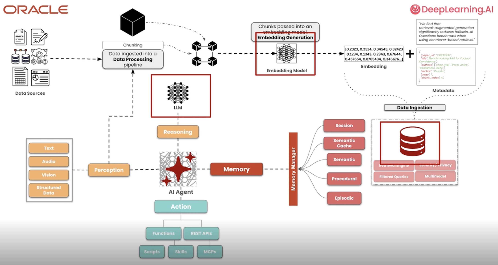
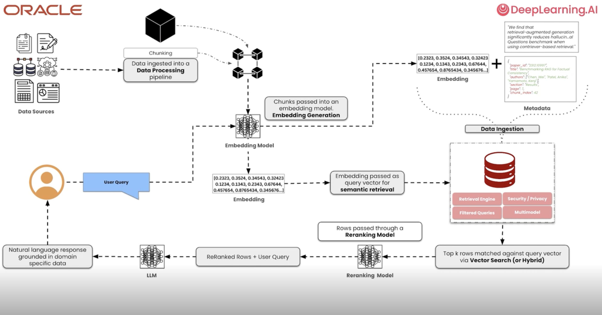
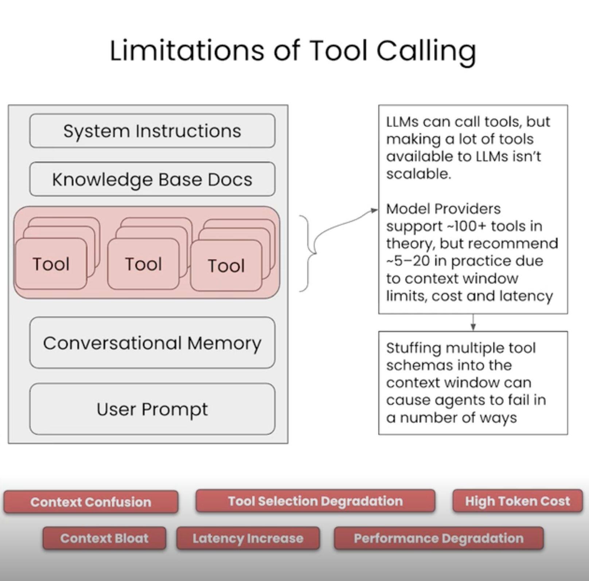
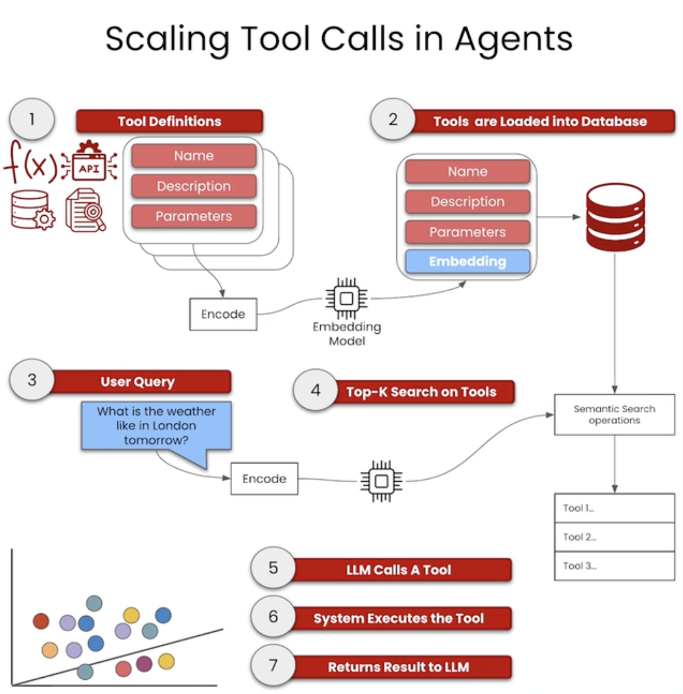

# Agent Memory: Building Memory-Aware Agents (DeepLearning.AI)

**Course:** [Agent Memory: Building Memory-Aware Agents](https://www.deeplearning.ai/short-courses/agent-memory-building-memory-aware-agents/)

Build and scale agents with semantic, episodic, and procedural memory systems for long-term context retention and intelligent decision-making.

## What you will learn

- Memory system architectures: semantic, episodic, and procedural memory
- Agent memory lifecycle and operations
- Context engineering and information retrieval
- Tool calling and scaling memory systems
- Practical implementation patterns for production agents

## Notebook order

| Order | Notebook             | Lesson title                  |
| ----- | -------------------- | ----------------------------- |
| 1     | [L2.ipynb](L2.ipynb) | Memory Systems Fundamentals   |
| 2     | [L3.ipynb](L3.ipynb) | Semantic Memory & Retrieval   |
| 3     | [L4.ipynb](L4.ipynb) | Episodic & Procedural Memory  |
| 4     | [L5.ipynb](L5.ipynb) | Scaling & Production Patterns |

## Visual Reference

Key concepts from the course:

_Memory system components and interactions_

_Memory operations flow during agent execution_

_Agent memory lifecycle stages_

_Memory unit structure and organization_

_Context engineering for memory retrieval_

_Full memory workflow in agentic systems_

_Integration with RAG for knowledge retrieval_

_Tool calling constraints and memory solutions_

_Scaling memory and tool systems_

## Setup

- **Packages:** `langgraph`, `langchain`, `anthropic` (Claude API), `faiss` or `chroma` for vector stores
- **Hardware:** CPU sufficient; GPU optional for embeddings
- **API keys:** Anthropic Claude API token ([.env.example](../.env.example))

## Tips

- Start with Lesson 2 to understand core memory concepts before diving into implementations
- Lessons 3–4 build incrementally; don't skip semantic memory before episodic
- Lesson 5 scales to production; test locally first before deploying
- Vector stores (FAISS, Chroma) require data indexing; see lesson notebooks for setup

## Key Concepts

**Semantic Memory:** Facts, knowledge, and relationships—stored as embeddings for similarity search

**Episodic Memory:** Events, interactions, and experiences—organized by time and context

**Procedural Memory:** Skills, workflows, and how-to knowledge—guides agent decision-making

**Context Engineering:** Selecting and ranking relevant memories to include in agent prompts

**Memory Lifecycle:** Encoding → Storage → Retrieval → Integration in agent reasoning

[← Back to learning path](../README.md)

## Extra Resources

https://github.com/oracle-devrel/oracle-ai-developer-hub
