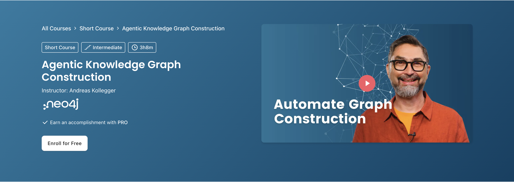

# Agentic Knowledge Graph Construction (DeepLearning.AI)

**Course:** [Agentic Knowledge Graph Construction](https://www.deeplearning.ai/courses/agentic-knowledge-graph-construction)

Build AI agents that turn raw structured and unstructured data into a **knowledge graph**, using Google's Agent Development Kit (ADK) with a Neo4j graph database. Agents infer user intent, suggest relevant files, propose a schema, and construct the graph.

## Prerequisites

- Comfort with LLM APIs and agent basics — e.g. [`../Long-Term Agentic Memory With LangGraph_DL.ai/`](../Long-Term%20Agentic%20Memory%20With%20LangGraph_DL.ai/Readme.md)
- Familiarity with graph/database concepts is helpful (Neo4j, Cypher)

## What you will learn

- Building agents with Google's ADK
- Capturing user intent and suggesting source files
- Proposing graph schemas for structured data
- Constructing and inspecting a knowledge graph in Neo4j

## Notebook order

| Order | Notebook | Lesson |
| ----- | -------- | ------ |
| 1 | [intro_to_adk_1.ipynb](intro_to_adk_1.ipynb) | L3 — Intro to Google's ADK (Part I) |
| 2 | [intro_to_adk_2.ipynb](intro_to_adk_2.ipynb) | L3 — Intro to Google's ADK (Part II) |
| 3 | [user_intent.ipynb](user_intent.ipynb) | L4 — Understanding User Intent |
| 4 | [file_suggestion.ipynb](file_suggestion.ipynb) | L5 — File Suggestions |
| 5 | [schema_proposal_structured.ipynb](schema_proposal_structured.ipynb) | L6 — Schema Proposal for Structured Data |
| 6 | [kg_construction_1.ipynb](kg_construction_1.ipynb) | L8 — Knowledge Graph Construction (Part I) |
| 7 | [kg_construction_2.ipynb](kg_construction_2.ipynb) | L8 — Knowledge Graph Construction (Part II) |

## Reference diagrams

- Graph construction plan: [graphconstruction.png](graphconstruction.png)
- Knowledge graph agent workflow: [knowledgegraphagent.png](knowledgegraphagent.png)

## Setup

- **Packages:** Google ADK, Neo4j client libraries, an LLM provider SDK (see each notebook's setup cell).
- **Services:** A running Neo4j instance and model API credentials (see [.env.example](../.env.example)).
- **Note:** Some lessons (1, 2, 7) from the course are not in this repo; the included notebooks cover ADK intro through graph construction.

Back to the [main learning path](../README.md).
