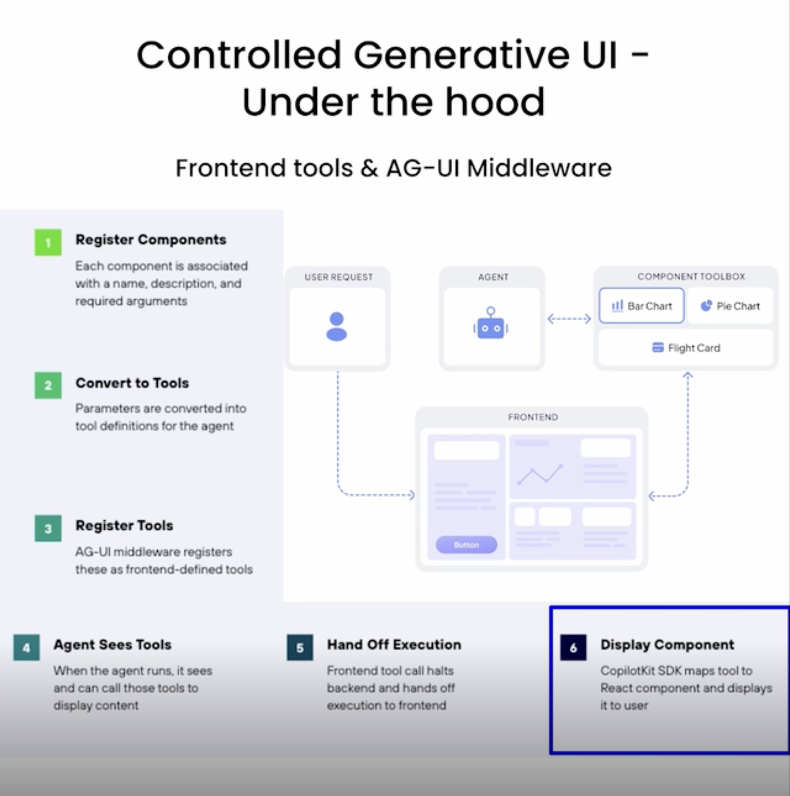
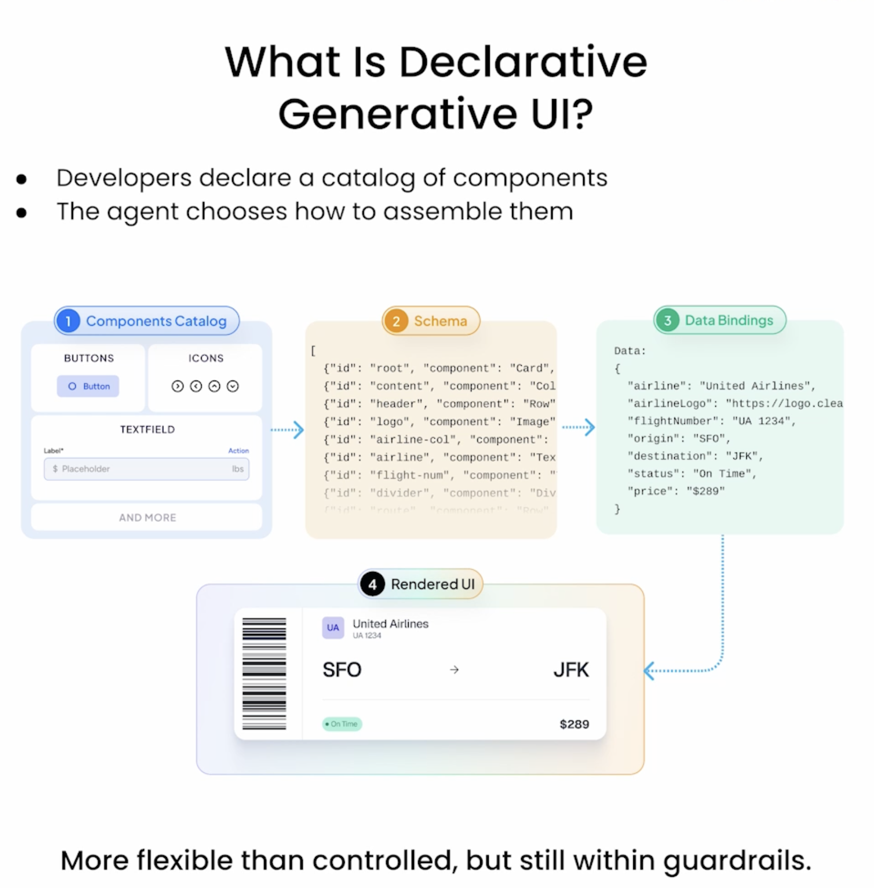
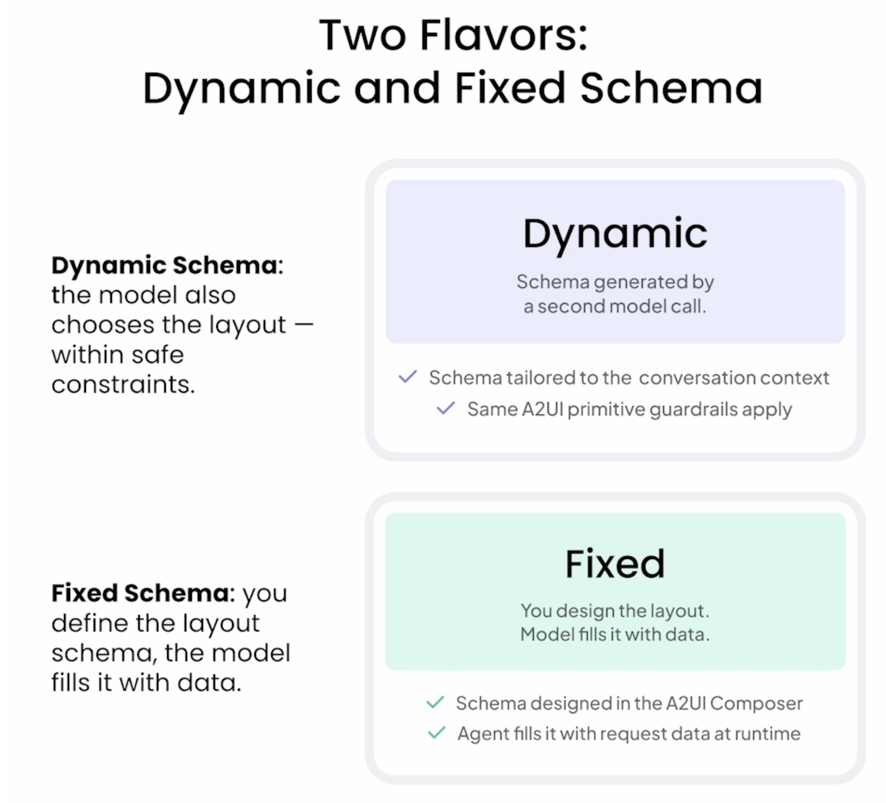

# Build Interactive Agents with Generative UI

**Folder:** `BuildInteractiveAgentswithGenerativeUI_DL.ai/` — [Course](https://www.copilotkit.ai/generative-ui)

Learn to build interactive AI agents using Generative UI frameworks. Master dynamic interfaces that generate content, respond to user inputs, and adapt in real time using LLMs.

---

## Overview

Generative UI is a framework that enables developers to build interactive agents powered by generative AI. It provides tools and components to create dynamic user interfaces that can generate content, respond to user interactions, and facilitate intelligent conversations.

---

## Four Types of Generative UI

### 1. **Controlled Generative UI**
Rules-based generation with constraints. Developers define specific guidelines and requirements that generative models must follow, ensuring consistent and predictable output.



### 2. **Declarative Generative UI**
Intent-based generation. Developers specify desired outcomes and behaviors at a high level, allowing models to generate content based on specifications without explicit rules.



### 3. **Dynamic Schema with Fixed Shapes**
Hybrid approach combining fixed schema structure with dynamic content generation. Models fill structured templates while maintaining predictability and control.



### 4. **Open-Ended Generative UI (Fully Open)**
Code-generating agents. Agents write and render the UI code dynamically, providing complete freedom in generating content and interactions for highly customizable interfaces.

---

## Learning Path

| Order | Concept | Focus |
| ----- | ------- | ----- |
| 1 | Fundamentals | Understanding Generative UI paradigms and architecture |
| 2 | Controlled UI | Building rule-based, constrained interfaces |
| 3 | Declarative UI | Creating intent-based, high-level specifications |
| 4 | MCP Integration | Embedding external apps and services |
| 5 | Full Generation | Building agents that write and render UI code |

---

## Key Topics

- **Generative UI Paradigms** — Controlled, declarative, and open-ended approaches
- **LLM Integration** — Prompt engineering and multi-turn conversations
- **Dynamic Rendering** — Real-time UI updates from AI responses
- **User Interactions** — Handling feedback loops and iterative refinement
- **Production Patterns** — Deploying generative agents at scale

---

## Resources

- **Official Docs:** [CopilotKit - Generative UI](https://www.copilotkit.ai/generative-ui)
- **Framework:** CopilotKit + React/Node.js
- **AI Models:** Claude, GPT, or compatible LLMs

---

## Setup

See parent [README.md](../README.md) for environment setup and Python requirements.

```bash
# Install dependencies
uv sync

# Copy and configure environment
cp ../.env.example ../.env
# Add API keys (OpenAI, Anthropic, etc.)
```
