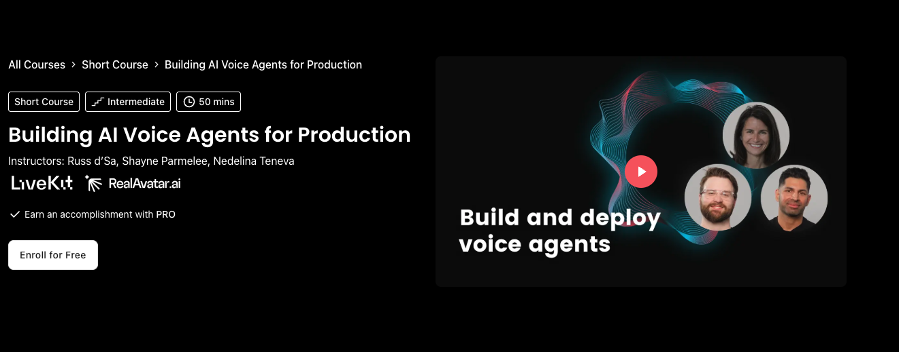

# Building AI Voice Agents for Production (DeepLearning.AI)

**Course:** [Building AI Voice Agents for Production](https://www.deeplearning.ai/courses/building-ai-voice-agents-for-production/)

Voice agent architecture and latency optimization for production deployments.

## Prerequisites

- [Long-Term Agentic Memory With LangGraph_DL.ai](../Long-Term%20Agentic%20Memory%20With%20LangGraph_DL.ai/Readme.md) or general agent + LLM API experience
- Comfort with async Python

## What you will learn

- Components of a production voice agent stack
- LiveKit-based agent sessions (as used in the labs)
- Measuring and optimizing latency

## Notebook order

| Order | Notebook | Lesson title |
| ----- | -------- | ------------ |
| 1 | [Lesson4.ipynb](Lesson4.ipynb) | Voice Agent Components |
| 2 | [Lesson5.ipynb](Lesson5.ipynb) | Optimizing Latency |

**Not in this repo:** Lessons 1–3. Complete them on the [course platform](https://www.deeplearning.ai/courses/building-ai-voice-agents-for-production/) before these notebooks.

## Setup

- **Packages:** `livekit`, `livekit-agents`, plugins as imported in notebooks (`livekit.plugins`), `python-dotenv` (see [requirements-notes.md](../requirements-notes.md) and in-notebook `pip` cells).
- **Hardware:** Microphone/speaker useful for live tests; Jupyter supports embedded agent UI in Lesson 4.
- **API keys:** LiveKit and model provider keys per course instructions ([.env.example](../.env.example)—add vars named in each notebook).

## Tips

- Lesson 4 notebooks are large (embedded UI assets); allow time to load.
- Outputs differ run-to-run for generative steps.

[← Back to learning path](../README.md)
