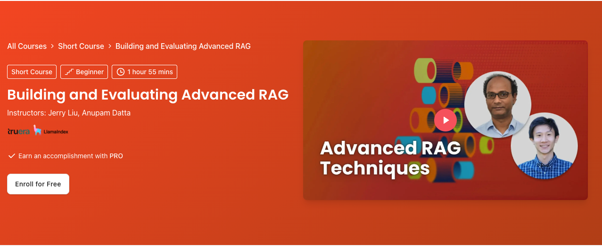

# Building and Evaluating Advanced RAG (DeepLearning.AI)

**Course:** [Building and Evaluating Advanced RAG](https://www.deeplearning.ai/courses/building-evaluating-advanced-rag/)

Advanced retrieval, indexing strategies, and RAG evaluation with LlamaIndex and TruLens.

## Prerequisites (external)

If you are new to RAG, work through hands-on basics first, then return here:

1. [rag-for-beginners](https://github.com/harishneel1/rag-for-beginners)
2. [multi-modal-rag-pipeline](https://github.com/harishneel1/multi-modal-rag-pipeline)

**In-repo prerequisites:** [BuildandTrainLLMwithJax_DL.ai](../BuildandTrainLLMwithJax_DL.ai/Readme.md) or equivalent LLM background; [Stanford CME295](../Stanford_CME295_Transformers_LLMs/Readme.md) Lecture 7 (RAG) is helpful.

Optional reading: [GraphRAG guide](https://medium.com/@brian-curry-research/graphrag-the-complete-guide-to-graph-powered-retrieval-augmented-generation-eeb58a6bb4d1)

## What you will learn

- End-to-end advanced RAG pipelines
- RAG “triad” evaluation metrics
- Sentence-window and auto-merging retrieval
- TruLens-style tracing and evaluation

## Notebook order

| Order | Notebook | Lesson title |
| ----- | -------- | ------------ |
| 1 | [L1-Advanced_RAG_Pipeline.ipynb](L1-Advanced_RAG_Pipeline.ipynb) | Advanced RAG Pipeline |
| 2 | [L2-RAG_Triad_of_metrics.ipynb](L2-RAG_Triad_of_metrics.ipynb) | RAG Triad of metrics |
| 3 | [L3-Sentence_window_retrieval.ipynb](L3-Sentence_window_retrieval.ipynb) | Sentence Window Retrieval |
| 4 | [L4-Auto-merging_Retrieval.ipynb](L4-Auto-merging_Retrieval.ipynb) | Auto-merging Retrieval |

## Setup

- **Packages:** LlamaIndex, OpenAI integration, TruLens (`trulens-eval`), plus course `utils` module if provided on the platform. See [requirements-notes.md](../requirements-notes.md). Notebooks use legacy `llama_index` import paths—install versions matching the course or follow `!pip` cells.
- **Hardware:** GPU optional; API calls dominate cost.
- **API keys:** `OPENAI_API_KEY` required ([.env.example](../.env.example)).

## Tips

- This repo may not include all course helper files (`utils.py`, data folders). Download the full course bundle from DeepLearning.AI if imports fail.
- You can rebuild similar pipelines with LangChain, Haystack, or LlamaIndex alone; this course standardizes on LlamaIndex + TruLens.

[← Back to learning path](../README.md)
