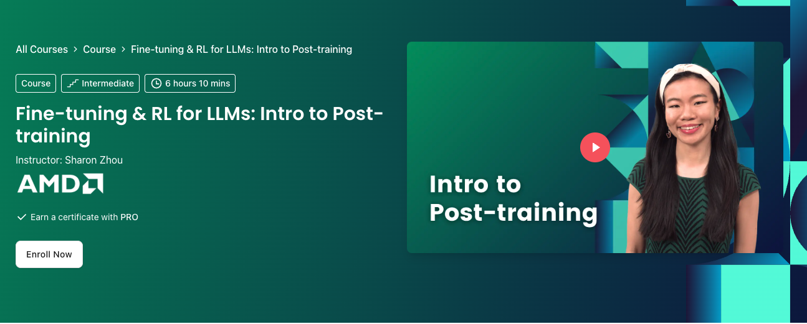

# Fine-tuning & RL for LLMs: Intro to Post-training (DeepLearning.AI)

**Course:** [Fine-tuning & RL for LLMs: Intro to Post-training](https://www.deeplearning.ai/courses/fine-tuning-and-reinforcement-learning-for-llms-intro-to-post-training/)

Post-training beyond SFT: inspection, fine-tuning, GRPO, evaluation, math reasoning, and production optimization.

## Prerequisites

- [Finetuning_DL.ai](../Finetuning_DL.ai/Readme.md)
- [Stanford CME295](../Stanford_CME295_Transformers_LLMs/Readme.md) Lectures 4–6 (helpful)

## What you will learn

- How post-trained models differ from base models
- Supervised fine-tuning and GRPO-style RL fine-tuning
- Evaluation, debugging, and production considerations

## Module order

| Order | Module | Notebook(s) | Focus |
| ----- | ------ | ----------- | ----- |
| 1 | `Module1:PostTrainingOverview` | [M1_G1_Inspecting_Finetuned_vs_Base_Model.ipynb](Module1:PostTrainingOverview/M1_G1_Inspecting_Finetuned_vs_Base_Model.ipynb) | Inspect finetuned vs. base |
| 2 | `Module2` | [M2_G1_fine_tune_lab_student.ipynb](Module2/M2_G1_fine_tune_lab_student.ipynb) | Fine-tune lab |
| 2 | `Module2` | [M2_G2_grpo_finetune_lab_student.ipynb](Module2/M2_G2_grpo_finetune_lab_student.ipynb) | GRPO post-training lab |
| 3 | `Module3` | [M3_G1_evaluation_and_debugging.ipynb](Module3/M3_G1_evaluation_and_debugging.ipynb) | Evaluation and debugging |
| 4 | `Module4` | [M4_G1_mathreasoning_student.ipynb](Module4/M4_G1_mathreasoning_student.ipynb) | Math reasoning |
| 5 | `Module5` | [M5_G1_Analysis_and_Optimization_in_Production_student.ipynb](Module5/M5_G1_Analysis_and_Optimization_in_Production_student.ipynb) | Production analysis |

Work modules **1 → 5** in order; within Module 2, run G1 then G2.

## Setup

- **Packages:** `transformers`, `trl`, `datasets`, `torch`, plus utilities referenced in notebooks (see [requirements-notes.md](../requirements-notes.md)).
- **Hardware:** GPU strongly recommended for Module 2+.
- **API keys:** Hugging Face token for models/datasets ([.env.example](../.env.example)).

## Tips

- Graded cells require exact variable names for autograding.
- GSM8K appears in GRPO lab; training can be long—use smaller step counts for dry runs.
- Module 1 uses a course `ServeLLM` helper in `utils.py` (download from course bundle if missing locally).

[← Back to learning path](../README.md)
