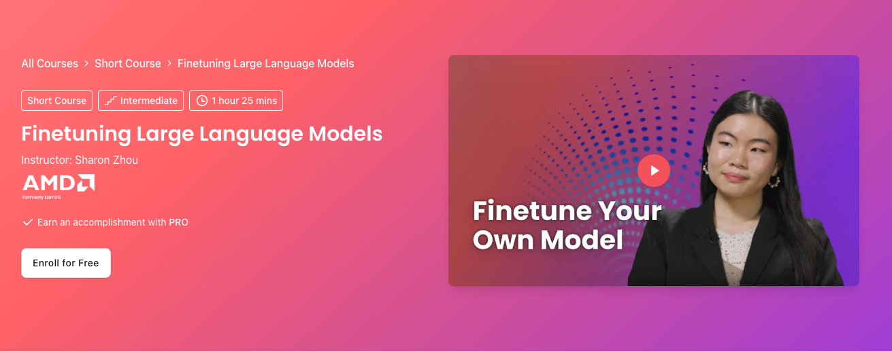

# Fine-tuning LLMs (DeepLearning.AI)

**Course:** [Finetuning Large Language Models](https://www.deeplearning.ai/courses/finetuning-large-language-models/)

Instruction tuning workflow: motivation, data, training, and evaluation.

## Prerequisites

- [PreTraining_DL.ai](../PreTraining_DL.ai/Readme.md) or equivalent pretraining background

## What you will learn

- When fine-tuning beats prompting or RAG alone
- Instruction datasets and Hugging Face dataset tooling
- Supervised fine-tuning and evaluation of chat models

## Notebook order

| Order | Notebook | Topic |
| ----- | -------- | ----- |
| 1 | [01_Why_finetuning_lab_student.ipynb](01_Why_finetuning_lab_student.ipynb) | Compare finetuned vs. base models |
| 2 | [02_Where_finetuning_fits_in_lab_student.ipynb](02_Where_finetuning_fits_in_lab_student.ipynb) | Finetuning vs. pretraining data |
| 3 | [03_Instruction_tuning_lab_student.ipynb](03_Instruction_tuning_lab_student.ipynb) | Instruction tuning |
| 4 | [04_Data_preparation_lab_student.ipynb](04_Data_preparation_lab_student.ipynb) | Data preparation |
| 5 | [05_Training_lab_student.ipynb](05_Training_lab_student.ipynb) | Training |
| 6 | [06_Evaluation_lab_student.ipynb](06_Evaluation_lab_student.ipynb) | Evaluation |

Run in numeric order (`01` → `06`).

## Setup

- **Packages:** `transformers`, `datasets`, `peft`, `trl`; GPU stacks often need `bitsandbytes` (see notebook cells).
- **Hardware:** GPU required for training labs.
- **API keys:** `HF_TOKEN` / `HUGGING_FACE_HUB_TOKEN` for model and dataset access ([.env.example](../.env.example)).

## Tips

- Outputs vary run-to-run (stochastic generation)—normal for LLM labs.
- Some cells show how to push datasets to the Hub; optional.

[← Back to learning path](../README.md)
