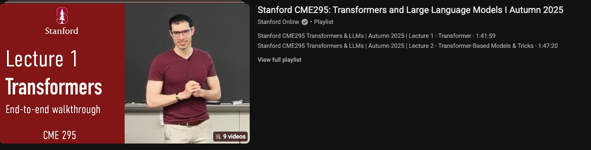

# Stanford CME295 — Transformers & LLMs

**Course:** [CME 295 — Transformers and LLMs](https://youtu.be/Ub3GoFaUcds?si=Du6rbm9ec3DcJuBr) · [Syllabus & lecture PDFs](https://cme295.stanford.edu/syllabus/)

Graduate-level lecture notes for Transformers and large language models (Fall 2025).

## Prerequisites

- [makemore](../makemore/Readme.md) or equivalent ML + sequence modeling basics
- Helpful after [Transformers_DL.ai](../Transformers_DL.ai/Readme.md) for hands-on tokenizer context

## What you will learn

- NLP foundations through Transformers and LLMs
- Training, tuning, reasoning, agents, RAG, and evaluation at a graduate depth
- Connections to later repo courses (pretraining, RL, RAG, agents)

## How to use this folder

There are **no notebooks** here—only PDFs and a cheatsheet.

1. Read lectures **in order** (1 → 9).
2. Use [cheatsheet-transformers-large-language-models.pdf](cheatsheet-transformers-large-language-models.pdf) for quick review before exams or interviews.
3. Map lectures to hands-on work elsewhere in this repo (see table below).

| Lecture | Topics | Related repo courses |
| ------- | ------ | -------------------- |
| 1 | Tokenization, embeddings, attention, Transformer | [Transformers_DL.ai](../Transformers_DL.ai/Readme.md) |
| 2 | MHA/MQA/GQA, RoPE, BERT family | [Transformers_DL.ai](../Transformers_DL.ai/Readme.md) |
| 3 | LLM architecture, MoE, prompting, CoT | [PreTraining_DL.ai](../PreTraining_DL.ai/Readme.md) |
| 4 | Pretraining, quantization, SFT, LoRA | [PreTraining_DL.ai](../PreTraining_DL.ai/Readme.md), [Finetuning_DL.ai](../Finetuning_DL.ai/Readme.md) |
| 5 | RLHF, DPO, preference tuning | [Post-training DL.ai](../Fine-tuning%20&%20RL%20for%20LLMs:%20Intro%20to%20Post-training_DL.ai/Readme.md) |
| 6 | Reasoning models, GRPO | Post-training Module 2 |
| 7 | RAG, agents, ReAct | [Advanced RAG](../BuildingandEvaluatingAdvancedRAG_DL.ai/Readme.md), [LangGraph memory](../Long-Term%20Agentic%20Memory%20With%20LangGraph_DL.ai/Readme.md) |
| 8 | LLM-as-judge, evaluation | [Finetuning_DL.ai](../Finetuning_DL.ai/Readme.md) lab 06, Post-training Module 3 |
| 9 | Trends, recap | — |

## Lecture files

| Lecture | Date (2025) | PDF |
| ------- | ----------- | --- |
| 1 — Transformer | Oct 3 | [fall25-cme295-lecture1.pdf](fall25-cme295-lecture1.pdf) |
| 2 — Transformer-based models & tricks | Oct 10 | [fall25-cme295-lecture2.pdf](fall25-cme295-lecture2.pdf) |
| 3 — Large Language Models | Oct 17 | [fall25-cme295-lecture3.pdf](fall25-cme295-lecture3.pdf) |
| 4 — LLM training | Oct 24 | [fall25-cme295-lecture4.pdf](fall25-cme295-lecture4.pdf) |
| 5 — LLM tuning | Nov 7 | [fall25-cme295-lecture5.pdf](fall25-cme295-lecture5.pdf) |
| 6 — LLM reasoning | Nov 14 | [fall25-cme295-lecture6.pdf](fall25-cme295-lecture6.pdf) |
| 7 — Agentic LLMs | Nov 21 | [fall25-cme295-lecture7.pdf](fall25-cme295-lecture7.pdf) |
| 8 — LLM evaluation | Dec 5 | [fall25-cme295-lecture8.pdf](fall25-cme295-lecture8.pdf) |
| 9 — Current trends | TBD | [fall25-cme295-lecture9.pdf](fall25-cme295-lecture9.pdf) |

Midterm was Oct 31, 2025 (materials on course site).

## Setup

- **Packages:** None required for PDFs.
- **Hardware:** Any PDF reader.

[← Back to learning path](../README.md)
