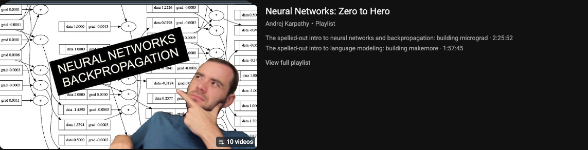

# makemore — Character-Level Language Models

**Course:** [Neural Networks: Zero to Hero](https://youtu.be/VMj-3S1tku0?si=pSHylWzr9XLT2DSJ) · [makemore (GitHub)](https://github.com/karpathy/makemore)

Name-generation models from bigrams through MLPs (Karpathy *makemore* series).

## Prerequisites

Complete [micrograd](../micrograd/Readme.md) (or equivalent comfort with backprop and PyTorch tensors).

## What you will learn

- Count-based and neural bigram models
- MLP language models over character vocabularies
- Training loops, sampling, and loss (negative log-likelihood)

## Notebook order

| Order | Notebook | Focus |
| ----- | -------- | ----- |
| 1 | [makemore_part1_bigrams.ipynb](makemore_part1_bigrams.ipynb) | Bigrams |
| 2 | [MLP.ipynb](MLP.ipynb) | MLP language model |
| 3 | [makemorepart3.ipynb](makemorepart3.ipynb) | Deeper MLP / batching |

**Data:** [names.txt](names.txt) must stay in this folder (used by the notebooks).

## Setup

- **Packages:** `torch`, `matplotlib` (see [requirements-notes.md](../requirements-notes.md)).
- **Hardware:** CPU is enough; GPU speeds up later notebooks slightly.
- **API keys:** Not required.

## Tips

- Part 1 is long but foundational; do not skip the NLL / softmax intuition sections.
- Keep `names.txt` path relative to this directory when opening notebooks from other working directories.

[← Back to learning path](../README.md)
